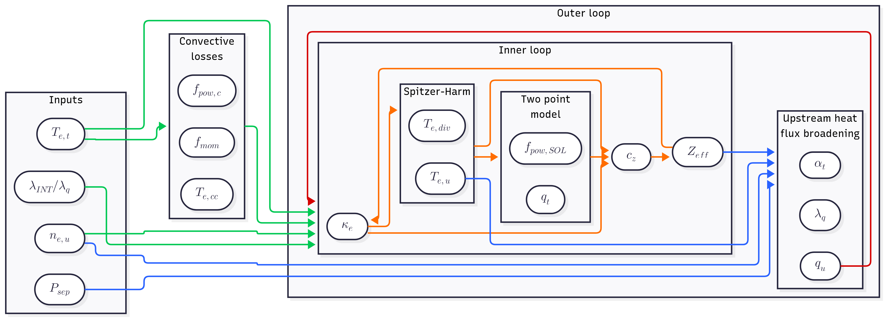

# Extended Lengyel model

[](https://arxiv.org/abs/2504.05486)
[](LICENSE)
[](https://github.com/cfs-energy/extended-lengyel/actions)



This project gives a Python implementation of the `extended Lengyel` model developed in Body, Kallenbach and Eich, 2025, submitted to Nuclear Fusion and available at [arxiv.org/abs/2504.05486](https://arxiv.org/abs/2504.05486). The project also reproduces the model presented in [Kallenbach et al., 2016, "Analytical calculations for impurity seeded  partially detached divertor conditions"](http://dx.doi.org/10.1088/0741-3335/58/4/045013).

The software can be found in the `extended_lengyel` folder. This contains the following subprojects
* `kallenbach_model`: the model introduced in Kallenbach et al., 2016, "Analytical calculations for impurity seeded  partially detached divertor conditions".
* `spatial_lengyel_model`: a version of the Lengyel model which does not switch to the temperature-integral form.
* `extended_lengyel_model`: the main extended Lengyel model discussed in the paper.

In addition to this, the software also has shared initialization and post-processing modules, as well as a module for interacting with data from OpenADAS using the [radas](https://github.com/cfs-energy/radas) library. The library is built as an extension of [cfspopcon](https://github.com/cfs-energy/cfspopcon), which allows for straightforward unit-handling and scanning of input parameters.

## Notebooks

All of the analysis given in the paper is run via Jupyter notebooks, which are available in the `notebooks` folder. To interact with these notebooks, you'll need to run `poetry run jupyter lab` in a terminal afer following the installation instructions below.

To run all of the notebooks to generate the outputs, you can also `poetry run python notebooks/run_notebooks.py`.

The analysis in the notebooks is configured via the `notebooks/config.yml` file (which is read by `extended_lengyel.config.read_config`). This converts a list of unit-containing strings to [pint.Quantity](https://pint.readthedocs.io/en/stable/user/defining-quantities.html) objects.

## Installation (for developers)

The extended Lengyel model can be installed using `poetry`, which can be installed via the [poetry installation guide](https://python-poetry.org/docs/#installation). Once you have poetry installed, installing the library should be as straightfoward as
```bash
poetry install
poetry run radas -s deuterium -s nitrogen -s neon -s argon
poetry run pytest
```

## A quick-start example

If want to use the extended Lengyel model to compute the impurity concentration for an experiment, you should be able to adapt the example below. We've added in-line comments to explain the steps.

```python
# The extended Lengyel model is built on top of cfspopcon, and we use a lot of the functionality from cfspopcon directly.
import cfspopcon
import extended_lengyel
# xarray (https://docs.xarray.dev/en/stable/) is used for storing results and scanning over parameters.
import xarray as xr
# cfspopcon unit handling is built using pint (https://pint.readthedocs.io/en/stable/index.html).
from cfspopcon.unit_handling import Quantity, ureg
# We use enumerators to constrain the atomic species which can be selected.
from cfspopcon.named_options import AtomicSpecies

# The first step is to declare which computations we want to perform. Instead of having a single function block, we break
# our analysis down into smaller 'algorithms'. These algorithms know the names and units of the input and output arguments.
# For instance, "calc_ion_flux_to_target" defines the variable parallel_ion_flux_to_target with units of "m**-2 / s" (declared
# in `extended_units.yaml`). This is needed by "calc_divertor_neutral_pressure".
# 
# To find an algorithm called "alg", search both cfspopcon and extended_lengyel for a function called "alg" with an
# @Algorithm.register_algorithm decorator, or a CompositeAlgorithm with name="alg".
algorithm = cfspopcon.CompositeAlgorithm.from_list([
    "calc_upstream_field",
    "calc_cylindrical_edge_safety_factor",
    "calc_fieldline_pitch_at_omp",
    "set_radas_dir",
    "read_atomic_data",
    "build_mixed_seeding_L_int_integrator",
    "calc_kappa_e0",
    "build_mixed_seeding_mean_charge_interpolator",
    "calc_momentum_loss_from_cc_fit",
    "calc_power_loss_from_cc_fit",
    "calc_electron_temp_from_cc_fit",
    "run_extended_lengyel_model_with_S_Zeff_and_alphat_correction",
    "calc_sound_speed_at_target",
    "calc_target_density",
    "calc_flux_density_to_pascals_factor",
    "calc_parallel_to_perp_factor",
    "calc_ion_flux_to_target",
    "calc_divertor_neutral_pressure",
    "calc_heat_flux_perp_to_target"
])

# Declare the impurities you want to seed. Mixed seeding is allowed.
impurity_species_list = ["Nitrogen", "Argon"]
impurity_weights_list = [1.0, 0.05]

# We store all of the input parameters in an xarray Dataset.
ds = xr.Dataset(data_vars=dict(
    impurity_weights_list                       = xr.DataArray(impurity_weights_list,
                                                               coords=dict(dim_species = impurity_species_list)),
    impurity_species_list                       = xr.DataArray([AtomicSpecies[k] for k in impurity_species_list],
                                                               coords=dict(dim_species = impurity_species_list)),
    # Declare other input parameters as pint Quantity objects with units.
    separatrix_electron_density                 = Quantity(3.3e19, ureg.m**-3),
    power_crossing_separatrix                   = Quantity(5.5, ureg.MW),
    fraction_of_P_SOL_to_divertor               = 2/3,
    target_electron_temp                        = Quantity(2.0, ureg.eV),
    divertor_broadening_factor                  = 3.0,
    plasma_current                              = Quantity(1.0, ureg.MA),
    magnetic_field_on_axis                      = Quantity(2.5, ureg.T),
    major_radius                                = Quantity(1.65, ureg.m),
    minor_radius                                = Quantity(0.5, ureg.m),
    ion_mass                                    = Quantity(2.0, ureg.amu),
    sheath_heat_transmission_factor             = 8.0,
    parallel_connection_length                  = Quantity(20, ureg.m),
    divertor_parallel_length                    = Quantity(5.0, ureg.m),
    elongation_psi95                            = 1.6,
    triangularity_psi95                         = 0.3,
    ratio_of_upstream_to_average_poloidal_field = 4/3,
    target_angle_of_incidence                   = Quantity(3.0, ureg.degree)
))

# The CompositeAlgorithm determines the minimum set of input arguments. The call to .validate_inputs makes sure
# you have the necessary inputs in the Dataset. If you've declared a variable which isn't used by the algorithm,
# you'll get a warning.
algorithm.validate_inputs(ds)

# We run the algorithm and update the dataset, which now stores both the inputs and outputs.
ds = algorithm.update_dataset(ds)

# Finally, we can interact with the dataset to see the outputs.
for species in ds["impurity_species_list"]:
    species = species.item().name
    cz = (ds["impurity_fraction"] * ds["impurity_weights_list"]).sel(dim_species=species).item()
    print(f"{species} concentration: {cz:.2}")
```

## Contributing

The extended Lengyel model is a research project, and there's plenty of room to extend the model with additional features. If you'd like to contribute to the project, contact the authors via the email in the paper or open a pull request. If you encounter any issues, bugs or mistakes, open an issue.
